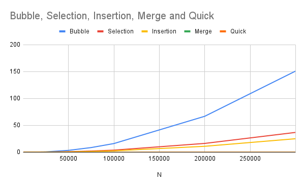

# Sort Analysis Data

## Results Table
Make sure to go out to at least 100,000 (more are welcome), and you have 10 different values (more welcome). You are welcome to go farther, but given 100,000 can take about 20 seconds using a selection sort on a fast desktop computer, and 200,000 took 77 seconds, you start having to wait much longer the more 0s you add. However, to build a clearer line, you will want more data points, and you will find merge and quick are able to handle higher numbers easier (but at a cost you will explore below). 

You are free to write a script to run the program and build your table (then copy that table built into the markdown). If you do that, please include the script into the repo.  Note: merge and quick sorts are going to be explored in the team activity for Module 06. You can start on it now, but welcome to wait.

 

### Table [^note]
| N | Bubble | Selection | Insertion | Merge* | Quick |
| :-- | :--: | :--: | :--: | :--: | :--: |
| 100     | 0.000014   | 0.000007   | 0.000004   | 0.000000  | 0.000004  |
| 500     | 0.000288   | 0.000123   | 0.000072   | 0.000000  | 0.000025  |
| 750     | 0.000606   | 0.000297   | 0.000172   | 0.000004  | 0.000045  |
| 1000    | 0.001051   | 0.000458   | 0.000281   | 0.000003  | 0.000053  |
| 2500    | 0.006216   | 0.002652   | 0.001663   | 0.000005  | 0.000181  |
| 5000    | 0.025408   | 0.010695   | 0.007012   | 0.000004  | 0.000343  |
| 10000   | 0.101702   | 0.041939   | 0.028239   | 0.000006  | 0.000722  |
| 25000   | 0.685435   | 0.254420   | 0.170266   | 0.000011  | 0.001916  |
| 50000   | 3.510423   | 0.992279   | 0.671804   | 0.000038  | 0.003997  |
| 75000   | 8.719232   | 2.296932   | 1.548970   | 0.000039  | 0.006471  |
| 100000  | 16.192056  | 3.934028   | 2.674454   | 0.000042  | 0.008976  |
| 200000  | 66.904928  | 16.439982  | 11.084632  | 0.000042  | 0.018715  |
| 300000  | 150.998411 | 36.901891  | 25.160644  | 0.000037  | 0.028576  |

*Merge sort not implemented yet

## BigO Analysis  / Questions

### 1. Build a line chart
Build a line chart using your favorite program. Your X axis will be N increasing, and your Y access will be the numbers for each type of sort. This will create something similar to the graph in the instructions, though it won't be as smooth. Due to speed differences, you may need to break up the $O(\log n)$ and $O(n^2)$ into different charts.

Include the image in your markdown. As a reminder, you save the image in your repo, and use [image markdown].

### 2. Analysis
Looking at the graph and the table, what can you say about the various sorts? Which are the fastest? Which are the slowest? Which are the most consistent? Which are the least consistent? Use this space to reflect in your own words your observations.

Quick sort is the fastest overall. it handles the larger amounts of data efficiently, with low times even as the number of items increases. Insertion sort also performs well for smaller data, but slows down as the data grows. Bubble Sort is the slowest. Its time increases dramatically with larger data amounts, making it less practical for big lists. Selection sort is a bit better than bubble sort but still much slower than quick or insertion sort. In terms of consistency, quick sort stays fast with increasing data size, while bubble and selection sorts become much slower and less reliable as the list size increases. [2]

### 3. Big O
Build another table that presents the best, worst, and average case for Bubble, Selection, Insertion, Merge, and Quick. You are free to use resources for this, but please reference them if you do. 

| Sorts  | Best Case | Average Case | Worst Case  |
| :-- | :-- | :-- | :-- |
| Bubble Sort    | O(n)      | O(n²)        | O(n²)       |
| Selection Sort | O(n²)     | O(n²)        | O(n²)       |
| Insertion Sort | O(n)      | O(n²)        | O(n²)       |
| Merge Sort     | O(n log n)| O(n log n)   | O(n log n)  |
| Quick Sort     | O(n log n)| O(n log n)   | O(n²)       | 

[2]

#### 3.2 Worst Case
Provide example of arrays that generate _worst_ case for Bubble, Selection, Insertion, Merge Sorts

| Sorts  | Worst-Case Array |
|:--|:--|
| Bubble Sort    | [7, 6, 5, 4, 3, 2, 1] |
| Selection Sort | [7, 6, 5, 4, 3, 2, 1] |
| Insertion Sort | [7, 6, 5, 4, 3, 2, 1] |
| Merge Sort     | [any array]           |

Worst case for Bubble, Selection, and Insertion are completely reversed arrays.

[2]

#### 3.3 Best Case
Provide example of arrays that generate _best_ case for Bubble, Selection, Insertion, Merge Sorts

| Sorts     | Best-Case Array|
|:--|:--|
| Bubble Sort     | [1, 2, 3, 4, 5, 6, 7]|
| Selection Sort  | [1, 2, 3, 4, 5, 6, 7]|
| Insertion Sort  | [1, 2, 3, 4, 5, 6, 7]|
| Merge Sort      | [any array]|

[2]

#### 3.4 Memory Considerations
Order the various sorts based on which take up the most memory when sorting to the least memory. You may have to research this, and include the mathematical notation. 

| Sort    | Memory |
| :--| :-- |
| Merge Sort     | O(n)|
| Bubble Sort    | O(1)|
| Selection Sort | O(1)|
| Insertion Sort | O(1)|

Most to least: Merge, Bubble, Selection, Insertion

[2]

### 4. Growth of Functions
Give the following values, place them correctly into *six* categories. Use the bullets, and feel free to cut and paste the full LatexMath we used to generate them.  

$n^2$  
$n!$  
$n\log_2n$  
$5n^2+5n$  
$10000$  
$3n$    
$100$  
$2^n$  
$100n$  
$2^{(n-1)}$
#### Categories
* $10000$, $100$
* $3n$, $100n$ 
* $n\log_2n$  
* $n^2$, $5n^2+5n$ 
* $2^n$, $2^{(n-1)}$
* $n!$ 

### 5. Growth of Function Language

Pair the following terms with the correct function in the table. 
* Constant, Logarithmic, Linear, Quadratic, Cubic, Exponential, Factorial

| Big $O$     |  Name  |
| ------      | ------ |
| $O(n^3)$    |  Cubic |
| $O(1)$      | Constant |
| $O(n)$      | Linear |
| $O(\log_2n)$ | Logarithmic |
| $O(n^2)$    | Quadratic |
| $O(n!)$     | Factorial |
| $O(2^n)$    | Exponential |

### 6. Stable vs Unstable
Look up stability as it refers to sorting. In your own words, describe one sort that is stable and one sort that isn't stable  

Insertion sort is stable because it preserves the relative order of elements that are equal. For example, if two equal numbers appear in the list, the one that comes first will still come before the other after sorting. [3]

Selection Sort is unstable because elements that are equal might get swapped around during sorting, so their original order could change. [3]

### 6.2 When stability is needed?
Explain in your own words a case in which you will want a stable algorithm over an unstable. Include an example.

When organizing a raid in World of Warcraft, it's important to preserve the original sign-up order of players, as it often reflects their role or priority in the group. Each entry includes a player's name and class. While you may want to sort the list by class to group similar roles together (like healers, tanks, or DPS), you still want to maintain the original order of names within each class to respect the sign-up sequence. This is where a stable sorting algorithm becomes essential as it allows you to sort by class without disrupting the order in which players signed up.

### Original Roster (Sign-Up Order)

- Sylvanas – Hunter  
- Thrall – Shaman  
- Jaina – Mage  
- Anduin – Priest  
- Falrien – Hunter  
- Velen – Priest  
- Elowen – Mage  
- Arthas – Death Knight  
- Grumak – Shaman  
- Morvash – Death Knight  

### Sorted by Class (Using Stable Sort)

- Arthas – Death Knight  
- Morvash – Death Knight  
- Sylvanas – Hunter  
- Falrien – Hunter  
- Jaina – Mage  
- Elowen – Mage  
- Anduin – Priest  
- Velen – Priest  
- Thrall – Shaman  
- Grumak – Shaman  

### 7. Gold Thief

You are planning a heist to steal a rare coin that weighs 1.0001 ounces. The problem is that the rare coin was mixed with a bunch of counter fit coins. You know the counter fit coins only weight 1.0000 ounce each. There are in total 250 coins.  You have a simple balance scale where the coins can be weighed against each other. Hint: don't think about all the coins at once, but how you can break it up into even(ish) piles. 

#### 7.1 Algorithm
Describe an algorithm that will help you find the coin. We encourage you to use pseudo-code, but not required.

#### 7.2 Time Complexity
What is the average time complexity of your algorithm? 

## Technical Interview Practice Questions

For both these questions, are you are free to use what you did as the last section on the team activities/answered as a group, or you can use a different question.

1. Select one technical interview question (this module or previous) from the [technical interview list](https://github.com/CS5008-khoury/Resources/blob/main/TechInterviewQuestions.md) below and answer it in a few sentences. You can use any resource you like to answer the question.

What is the difference between a compiled and an interpreted language? Which one is better? Give an example of each.

A compiled language, like C, takes your whole program and translates it into machine code before it runs. This makes it fast and efficient because the computer can read it directly. An interpreted language, like Python, doesn’t do that all at once. It reads and runs your code one line at a time, which can be slower but easier to test and change. Compiled languages are great when speed matters, like in games or operating systems. Interpreted languages are better for learning, quick fixes, or small tasks.[1]

2. Select one coding question (this module or previous) from the [coding practice repository](https://github.com/CS5008-khoury/Resources/blob/main/LeetCodePractice.md) and include a c file with that code with your submission. Make sure to add comments on what you learned, and if you compared your solution with others. 
 
[remove_duplicates.c] (https://github.com/CS5008Fall2025/homework-sorts-zembug/blob/main/remove_duplicates.c)

## Deeper Thinking
Sorting algorithms are still being studied today. They often include a statistical analysis of data before sorting. This next question will require some research, as it isn't included in class content. When you call `sort()` or `sorted()` in Python 3.6+, what sort is it using? 

#### Visualize
Find a graphic / visualization (can be a youtube video) that demonstrates the sort in action. 

#### Big O
Give the worst and best case time-complexity, and examples that would generate them. 

## References
Add your references here. A good reference includes an inline citation, such as [1] , and then down in your references section, you include the full details of the reference. Use [ACM Reference format].

1. IBM Documentation. Compiled versus interpreted languages. (1990, 2010). Retrieved Septemebr 28, 2025 from https://www.ibm.com/docs/en/zos-basic-skills?topic=zos-compiled-versus-interpreted-languages

2. GeeksforGeeks. Sorting Algorithms. (August 24, 2025). Retrieved September 28, 2025 from https://www.geeksforgeeks.org/dsa/sorting-algorithms/

3. GeeksforGeeks. Stable and Unstable Sorting Algorithms. (July 23, 2025). Retrieved September 28, 2025 from https://www.geeksforgeeks.org/dsa/stable-and-unstable-sorting-algorithms/

## Footnotes:
[^note]: You will want at least 10 different N values, probably more to see the curve for Merge and Quick. If bubble, selection, and insertion start to take more than a  minute, you can say $> 60s$ or - . For example 
    | N | Bubble | Selection | Insertion | Merge | Quick |
    | :-- | :--: | :--: | :--: | :--: | :--: |
    | 10,000|0.197758|0.070548|0.000070|0.000513|0.000230|
    |100,000|-|-|-|0.131061|0.018602|

<!-- links moved to bottom for easier reading in plain text (btw, this a comment that doesn't show in the webpage generated-->
[image markdown]: https://docs.github.com/en/get-started/writing-on-github/getting-started-with-writing-and-formatting-on-github/basic-writing-and-formatting-syntax#images

[ACM Reference Format]: https://www.acm.org/publications/authors/reference-formatting
[IEEE]: https://www.ieee.org/content/dam/ieee-org/ieee/web/org/conferences/style_references_manual.pdf